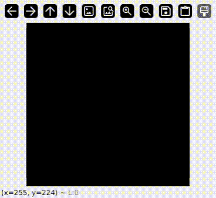

# mnist-draw
Interactive demo program of a neural network classifying a handwritten digits.

## Setup
### Prerequisite
* Python
* PyTorch
* Torchvision
* OpenCV
* Numpy

### Run the interactive program
To run the interactive program, run `draw.py` on your terminal. This program uses the pretrained weights in this repository. Press the escape button to quit the program or the 'r' key to clear the canvas.

### Train your own model
Run `train.py` to train the model. The model consists of a CNN layer and 2 linear layer. The model is created with the PyTorch library.
